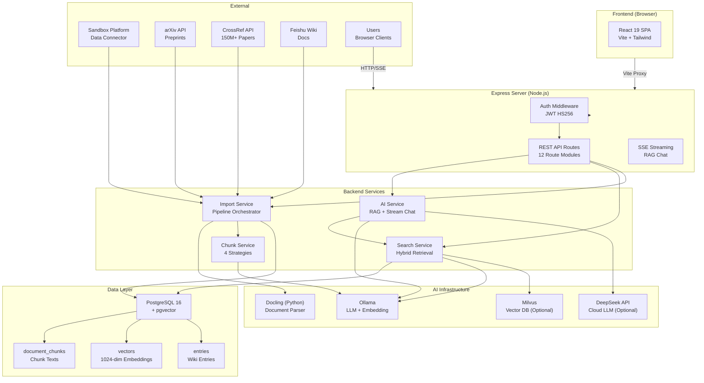

# 02 — 系统架构 (System Architecture)

> **目标读者**: DevOps / SRE
> **阅读时间**: 15 分钟

---

## 2.1 架构总览



---

## 2.2 核心组件说明

### 2.2.1 Express Server (server/)

| 组件 | 路径 | 说明 |
|------|------|------|
| 入口 | `server/index.ts` | 启动 Express（API + 可选静态文件服务） |
| App 工厂 | `backend/app.ts` | 创建 Express 实例，注册路由 |

`server/index.ts` 是唯一的应用入口点。通过环境变量 `SERVE_STATIC` 控制模式：
- `SERVE_STATIC=false`（默认）：仅 API，开发时 Vite 独立提供前端
- `SERVE_STATIC=true`：API + 前端 SPA（生产部署用）

### 2.2.2 路由模块

| 路由基路径 | 文件 | 认证 | 说明 |
|-----------|------|------|------|
| `/api/auth` | `routes/auth.ts` | 混合 | 登录、注册、用户信息 |
| `/api/entries` | `routes/entries.ts` | 混合 | 知识条目的 CRUD |
| `/api/search` | `routes/search.ts` | optional | 语义搜索 + 数据库查询 |
| `/api/ai` | `routes/ai.ts` | 混合 | AI 聊天（普通 + SSE 流式） |
| `/api/pipeline` | `routes/pipeline.ts` | 无 | 数据管道（解析/分块/嵌入/导入） |
| `/api/files` | `routes/files.ts` | 混合 | 文件管理 |
| `/api/categories` | `routes/categories.ts` | 混合 | 分类管理 |
| `/api/tags` | `routes/tags.ts` | 混合 | 标签管理 |
| `/api/data-items` | `routes/dataItems.ts` | 混合 | 数据条目 |
| `/api/graph` | `routes/graph.ts` | optional | 知识图谱数据 |
| `/api/spaces` | `routes/spaces.ts` | optional | 空间/分类视图 |
| `/api/connectors` | `routes/connectors.ts` | 公开 | 文献检索 + 外部连接器 (arXiv/CrossRef/Sandbox/Feishu) |

### 2.2.3 认证中间件

| 中间件 | 说明 |
|--------|------|
| `requireAuth` | 强制认证 — 无有效 Token 返回 401 |
| `optionalAuth` | 可选认证 — 有 Token 则解析，无则继续（游客模式） |

认证流程：
1. 用户登录 → 验证密码（bcrypt）→ 签发 JWT（有效期 24h）
2. 后续请求带 `Authorization: Bearer <token>`
3. 中间件验证签名 + 过期时间
4. `req.user` = `{ userId, username, role }`，`req.isInternal` = boolean

### 2.2.4 LLM Provider 工厂

```
LLM_PROVIDER env var
         │
         ├── "ollama"  → OllamaProvider  (本地, /v1/chat/completions)
         ├── "deepseek"→ DeepSeekProvider (云端, api.deepseek.com/v1)
         └── (default) → OllamaProvider
```

两种 Provider 都实现统一的 `LLMProvider` 接口：
- `chat(messages)` → 非流式（返回完整回答字符串）
- `streamChat(messages)` → 流式（AsyncGenerator，逐 token 输出）

### 2.2.5 向量存储双重策略

```
vectorRepository
       │
       ├── 主: PgvectorStore（PostgreSQL pgvector）
       │     - 自动就绪（PostgreSQL 连接即 ready）
       │     - 适合 < 500K 向量
       │     - COSINE 距离度量
       │
       └── 可选: MilvusClient（Milvus 向量数据库）
             - 需安装 @zilliz/milvus2-sdk-node
             - 适合大规模向量（百万级+）
             - IVF_FLAT 索引，COSINE 度量
             - 目前代码中 search.service 使用 vectorRepository
               （默认 pgvector），Milvus 路径通过 milvusClient 独立使用
```

### 2.2.6 混合检索 (Hybrid Search)

```
用户查询
    │
    ├── [向量检索] query → bge-m3 embedding → pgvector cosine search → top-K
    │
    ├── [关键词检索] query → 分词 → PostgreSQL LIKE 匹配 → scored results
    │       │
    │       └── Token 策略:
    │           - 中文: bigram + trigram（滑动窗口）
    │           - 英文: word + hyphenated compound
    │           - 过滤停用词（中英文）
    │
    └── [合并] 向量结果 + 关键词补充去重 → 最终结果
```

### 2.2.7 文档导入管道

```
输入 (File/Buffer/String)
    │
    ├── Stage 1: Parse
    │   └── Docling (Python CLI) → Markdown + 结构化属性
    │       支持: PDF, DOCX, PPTX, XLSX, HTML, MD, CSV, TXT, Images
    │       重试: 最多 3 次，指数退避
    │
    ├── Stage 2: Chunk (事务内)
    │   ├── 创建 entry 记录
    │   ├── Markdown-aware 分块（默认策略: markdown, 1024 字符, 128 重叠）
    │   ├── 持久化 document_chunks
    │   └── 提取属性表（如有）
    │
    ├── Stage 3: Embed
    │   └── Ollama bge-m3 批量向量化（batch API，回退并发/串行）
    │
    └── Stage 4: Vector Store
        └── 向量写入 pgvector（onConflictDoUpdate）
```

### 2.2.8 RAG 对话流程

```
1. 用户提问
       │
2.     ├── 获取对话历史（如有 conversationId）
       │
3.     ├── 查询向量化 → pgvector 语义搜索 (topK=10)
       │
4.     ├── 关键词搜索补充（去重，最多 topK）
       │
5.     ├── 从 document_chunks 表读取完整分块文本
       │
6.     ├── 构建 System Prompt:
       │   "你是一个企业科研知识助手。以下是从知识库中检索到的相关文档块：
       │    [Chunk 1] (来自: <条目标题>, 章节: <标题>)
       │    [Chunk 2] ...
       │    请基于以上文档块回答用户问题，引用来源。"
       │
7.     ├── 调用 LLM（流式），传入 system + history + question
       │
8.     └── SSE 逐 token 推送前端
```

---

## 2.3 数据模型

### 核心表

| 表名 | 说明 | 关键字段 |
|------|------|----------|
| `users` | 用户 | id, username, password_hash, role(admin/editor/viewer) |
| `categories` | 分类目录 | id, name, sort_order |
| `tags` | 标签 | id, name(unique) |
| `entries` | 知识条目 | id, title, entry_type, summary, content, visibility, deleted_at |
| `entry_tags` | 条目-标签关联 | entry_id, tag_id (联合主键) |
| `wiki_files` | 上传文件 | id, entry_id, original_filename, storage_path |
| `data_items` | 数据条目 | id, entry_id(unique), data_name, schema_version |
| `document_chunks` | 文档分块 | id(PK), entry_id, text, metadata(jsonb) |
| `vectors` | 向量嵌入 | chunk_id(PK), entry_id, embedding(vector 1024) |
| `conversations` | AI 对话 | id, user_id, title |
| `chat_messages` | 对话消息 | id, conversation_id, role, content, sources(jsonb) |

### Entry Type 枚举

| 值 | 中文 | 说明 |
|----|------|------|
| `asset` | 资产/素材 | 图片、流程图、宣发素材 |
| `product` | 产品/项目 | Sandbox 项目、业务产品 |
| `tech` | 技术能力 | 技术方案、算法说明 |
| `patent` | 专利 | 专利成果 |
| `data_item` | 数据条目 | 研发数据标准 Schema |

### Visibility 枚举

| 值 | 说明 |
|----|------|
| `public` | 公开 — 所有用户可见 |
| `internal` | 内部 — 仅登录用户可见 |

---

## 2.4 数据库索引

| 索引名 | 表 | 列 | 用途 |
|--------|-----|-----|------|
| `entries_entry_type_idx` | entries | entry_type | 按类型过滤 |
| `entries_visibility_idx` | entries | visibility | 按可见度过滤 |
| `entries_category_idx` | entries | category_id | 按分类过滤 |
| `entries_updated_at_idx` | entries | updated_at DESC | 按更新时间排序 |
| `entries_deleted_at_idx` | entries | deleted_at | 软删除过滤 |
| `entry_tags_tag_idx` | entry_tags | tag_id | 标签关联查询 |
| `wiki_files_entry_idx` | wiki_files | entry_id | 文件关联查询 |
| `data_items_entry_idx` | data_items | entry_id | 数据条目关联 |
| `document_chunks_entry_idx` | document_chunks | entry_id | 分块关联查询 |
| `vectors_entry_idx` | vectors | entry_id | 向量关联查询 |
| `chat_messages_conv_idx` | chat_messages | conversation_id | 对话消息查询 |
